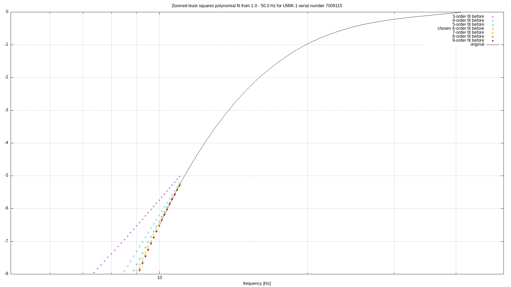

# UMIK-1

Documentation and custom software for calibrated omni-directional USB measurement
microphone [UMIK-1](https://minidsp.com/products/acoustic-measurement/umik-1)
from [miniDSP](https://minidsp.com) are offered here. An overall analysis of the
sensitivity and frequency response from the calibration files can be found, as
well as documentation on how to record on Linux systems such as a Raspberry Pi.

More importantly, extended calibration files and equalizers can be generated for
each UMIK-1 serial number. This is done with high order interpolation and
extrapolation for most industry standard sample frequencies. The results
increase the calibration range and resolution of your UMIK-1 with
[Audacity](https://audacityteam.org), [SoX](http://sox.sourceforge.net) or your
own custom software.

## Recording

You can record on Linux with the SoX as follows. Install SoX with this command.

    sudo apt-get install sox

Query the machine for which audio device are available.

    arecord -l|grep ^card

This will return a card number and a device number. Also it will show what the
dip switches settings for the gain in dB
[inside the microphone](https://www.minidsp.com/forum/umik-questions/9249-umik-new-pcb-installation-question).

    **** List of CAPTURE Hardware Devices ****
    card 1: U0dB [Umik-1  Gain:  0dB], device 0: USB Audio [USB Audio]
      Subdevices: 1/1
      Subdevice #0: subdevice #0

The factory settings used to be 12dB but is
[currently](https://www.minidsp.com/forum/umik-questions/10285-umik-1-standard-factory-gain)
18dB. Possible values are 0dB, 6dB, 12dB, 18dB, 24dB, 30dB and 36dB. This is
very practical that the settings are show on the command line. That prevents
opening the microphone to see what the gain via the dip switches is set to.

Set the following two environment variables to use the microphone in the
example above.

    export AUDIODEV=hw:1,0
    export AUDIODRIVER=alsa

Note that here `1` is the card number and `0` is the device number. Use the
values relevant for what the machine offers.

Recording with SoX 60 seconds after 5 seconds of waiting:

    rec -q -r 48000 -c 1 -b 24 --buffer 16384 filename.wav trim 5 60

Recording with Audacity works after selecting the 'Microphone - 2.0 root hub'
device for sound input in the sound settings of your window manager. Press 'r'
to start recording and 'space' to stop recording.

## Calibration

In directory `scripts` are scripts to download calibration files, analyse them
and generate improved calibration files supporting a wider range of frequencies.
See directory `download` of downladed calibration files and directory `stripped`
for the files stripped for further processing.

In the directory `overview` are some overview plots generated on all downloaded
and stripped files. The directory `generated` offers extended calibration files
and graphs in zip files. The calibration files are interpolated and
extrapolated to offer more frequency ranges. The files are self explanatory.
The files also support processing with SoX or Audacity. Some examples are:

[Extended calibration](example/7009115-fit-response.tsv)

Extended calibrations for e.g. SoX for sample frequencies of [375 Hz](example/7009115-fit-sampled-response-375.xml),  [3 kHz](example/7009115-fit-sampled-response-3000.xml),  [44.1 kHz](example/7009115-fit-sampled-response-44100.xml) and [48 kHz](example/7009115-fit-sampled-response-48000.xml)

Audacity equalizers for sample frequencies of [375 Hz](example/7009115-fit-audacity-equalizer-375.xml),  [3 kHz](example/7009115-fit-audacity-equalizer-3000.xml),  [44.1 kHz](example/7009115-fit-audacity-equalizer-44100.xml) and [48 kHz](example/7009115-fit-audacity-equalizer-48000.xml)

These files can be loaded into Audacity under `Effect / Filter Curve EQ` and
`Effect / Graphic Eq`. However, the format used by Audacity has changed (or I
cannot find where it uses XML for the equalizer) and this needs refactoring.

Please, create an [issue](https://github.com/PanderMusubi/umik-1/issues) for
serial numbers to support, as generating these files for all available
calibration files does not fit in the available storage here.

## Practical tips

Best is to give each microphone an extra label with its serial number as the
default label with barcode can
[smudge](https://www.minidsp.com/forum/umik-questions/11202-labels-with-serial-numbers-smudge)
and turn unreadable.

Even you do not open the microphone to change its gain via dip switches, the
ring holding the microphone closed can sometimes become loose. Check this
sometimes to prevent damage.

## See also

Product description
https://www.minidsp.com/products/acoustic-measurement/umik-1

Product brief
https://www.minidsp.com/images/documents/Product%20Brief%20-%20Umik.pdf

Product forum
https://www.minidsp.com/forum/umik-questions

Product FAQ
https://minidsp.desk.com/customer/portal/topics/644663-umik-1-related-questions/articles

Home Theater Forum
https://www.hometheatershack.com/forums/spl-meters-mics-calibration-sound-cards/63808-minidsp-umik-1-microphone.html

# Issues

Report following error in `7005770.txt` and its 90 degrees version. The double
minus should be one minus:

    19.369	-3.1312
    19.611	--3.1221
    19.855	-3.1116

The following range misses its minus:

    36.403	-1.4134
    36.857	-1.3674
    37.315	-1.3214
    37.78	1.2752
    38.25	1.2285
    38.726	1.1812
    39.209	1.1329
    39.697	1.0835
    40.191	1.0335
    40.691	0.9834
    41.198	0.9346
    41.711	0.8880
    42.23	0.8446
    42.756	0.8050
    43.288	0.7687
    43.827	0.7347
    44.372	0.7022
    44.925	0.6699
    45.484	0.6369
    46.05	0.6023
    46.623	0.5654
    47.204	0.5259
    47.791	0.4835
    48.386	0.4385
    48.989	0.3913
    49.599	0.3424
    50.216	0.2923
    50.841	0.2420
    51.474	0.1922
    52.115	0.1441
    52.764	0.0986
    53.42	0.0567
    54.085	0.0192
    54.759	-0.0128
    55.44	-0.0388
    56.131	-0.0581

and the following entry misses a minus:

    131.807	-0.1416
    133.448	0.1403
    135.109	-0.1391

This has been manually fixed here in the downloaded file and should be reported
upstream. Also a few more files have similar issues. These should be detected,
fixed and reported upstream too.
